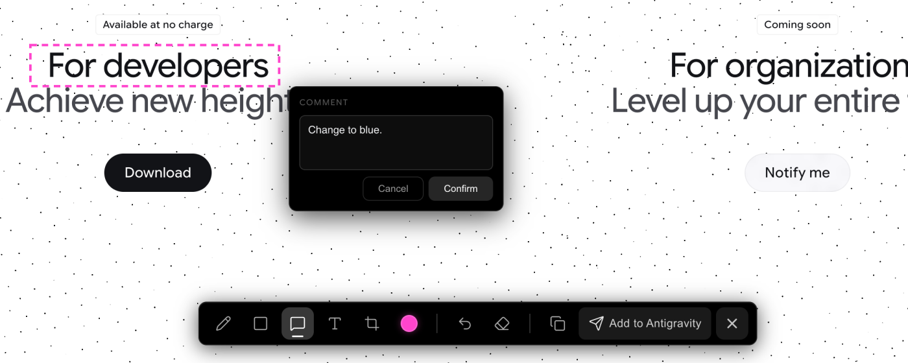

# Antigravity Annotator

> A Chrome extension for capturing, annotating, and sharing webpage screenshots with Antigravity.


## Overview

Antigravity Annotator is a browser extension that lets you capture a full screenshot of the current webpage, annotate it with drawing tools, highlights, comments, and text, then inject the result directly into **Antigravity** for AI-assisted development. Built for developers who need a fast feedback loop between the browser and Antigravity.



---

## 📦 Download & Installation

### Step 1 — Install the Chrome Extension

You can install the Chrome extension in **two ways**:

#### Option A: Direct Download (Recommended)

1. **Download** the latest pre-built package from this repository:
   👉 [`Annotator-Chrome-Extension-1.0.6.zip`](./Annotator-Chrome-Extension-1.0.6.zip)

2. **Unzip** the downloaded file to a local folder on your computer.

3. Open Chrome and navigate to `chrome://extensions/`

4. Enable **Developer Mode** by toggling the switch in the top-right corner.

5. Click **"Load unpacked"** and select the unzipped folder.

6. The **Annotator** icon will appear in your Chrome toolbar — pin it for quick access.

#### Option B: Chrome Web Store *(Coming Soon)*

> 🕐 The extension is currently **under review** on the Chrome Web Store.
> Once approved, you will be able to search for **"Annotator for Antigravity"** directly in the Chrome Web Store and install it with one click — no Developer Mode required.

#### Option C: From Source

```bash
git clone https://github.com/litwalle/Antigravity-Annotator-1.0.git
cd annotator-react
npm install
npm run build
```

Then load the `annotator-extension/` folder via **Load unpacked** as described above.

---

### Step 2 — Install the Antigravity Companion Extension

To enable image injection from the browser into Antigravity, you also need to install the companion extension inside **Antigravity**.

✅ **This extension is now live on the VS Code Marketplace:**

> Open the **Extensions** panel in Antigravity (`Cmd+Shift+X`), search for **`Annotator for Antigravity`**, and click **Install**.
>
> Or install directly from the [VS Code Marketplace →](https://marketplace.visualstudio.com/items?itemName=litwalle.antigravity)

**Setup steps:**
1. Open **Antigravity**.
2. Go to the **Extensions** panel (`Cmd+Shift+X`).
3. Search for **`Annotator for Antigravity`**.
4. Click **Install**.
5. *(Optional)* Reload the Antigravity window to ensure the local bridge server starts correctly.

---

## Features

- **Screenshot Capture** — One-click capture of the visible webpage
- **Crop Tool** — Crop the screenshot to focus on specific areas
- **Freehand Drawing** — Draw freely with customizable neon colors
- **Highlight** — Highlight areas with semi-transparent rectangles
- **Comments** — Create comment boxes with pointer lines for contextual feedback
- **Text Annotations** — Place text directly on the screenshot
- **Image & Prompt Integration** — Seamlessly copy annotated images and generated context prompts
- **Send to Antigravity** — Push annotated screenshots directly into Antigravity chat
- **Keyboard Shortcuts** — Full shortcut support for fast workflows
- **Retina Support** — Full-resolution rendering on high-DPI displays
- **Isolated Rendering** — Shadow DOM ensures zero style conflicts with the host page

---

## Keyboard Shortcuts

| Shortcut | Action |
|----------|--------|
| `P` | Freehand drawing tool |
| `H` | Rectangle highlight tool |
| `C` | Comment tool |
| `T` | Text tool |
| `⌘Z` / `Ctrl+Z` | Undo |
| `Escape` | Close annotator |

## Color Palette

8 neon colors available: Fluorescent Yellow, Green, Cyan, Blue, Purple, Pink, Red, and Orange.

---

## Tech Stack

| Layer | Technologies |
|-------|-------------|
| UI Framework | React 19, TypeScript 5.9 |
| Styling | Tailwind CSS 4, Radix UI, Lucide Icons |
| Build Tool | Vite 7 |
| Extension | Chrome Manifest V3, Shadow DOM, Canvas API |

---

## Project Structure

```
├── Annotator-Chrome-Extension-1.0.6.zip   # Pre-built Chrome extension (ready to install)
├── preview.png                             # Preview screenshot
├── annotator-extension/    # Chrome extension source files
│   ├── manifest.json
│   ├── background.js
│   ├── content.js
│   ├── content.css
│   └── icons/
├── annotator-react/        # React source code
│   └── src/
│       ├── AnnotatorApp.tsx
│       └── content.tsx
└── antigravity-vscode-companion/   # Antigravity companion extension source
```

---

## Development

```bash
cd annotator-react
npm install
npm run dev       # Development
npm run build     # Production build
```

After building, the compiled output is placed in `annotator-extension/` and can be loaded directly as an unpacked Chrome extension.

---

## License

MIT
